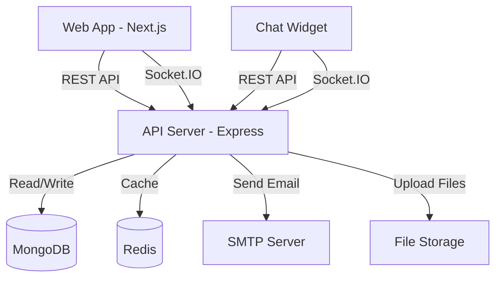

## Overview

Voxora is built as a modern, scalable monorepo application with separate frontend and backend services that communicate via REST APIs and WebSocket connections.

## System Architecture



## Core Components

### 1. Web Application (apps/web)

<Card title="Technology Stack" icon="react">
  - **Framework**: Next.js 15 (App Router)
  - **UI Library**: React 19
  - **Styling**: Tailwind CSS
  - **State Management**: React Hooks + Context
  - **Build Tool**: Turbopack
</Card>

**Responsibilities:**
- Agent dashboard and admin interface
- Real-time conversation management
- Team and department management
- Analytics and reporting
- User authentication

**Key Features:**
- Server-side rendering (SSR)
- Static site generation (SSG) where applicable
- Real-time updates via Socket.IO
- Responsive design with Tailwind CSS

### 2. API Server (apps/api)

<Card title="Technology Stack" icon="server">
  - **Framework**: Express 5
  - **Real-time**: Socket.IO
  - **Database ORM**: Mongoose
  - **Caching**: Redis
  - **Authentication**: JWT
</Card>

**Responsibilities:**
- RESTful API endpoints
- WebSocket connections for real-time chat
- User authentication and authorization
- Business logic and data validation
- Database operations
- Email notifications

**API Structure:**
```
/api/v1
├── /auth          # Authentication endpoints
├── /users         # User management
├── /conversations # Chat conversations
├── /messages      # Message handling
├── /agents        # Agent management
├── /departments   # Department organization
└── /analytics     # Usage statistics
```

### 3. Chat Widget

<Card title="Technology Stack" icon="window">
  - **Format**: Vanilla JavaScript
  - **Styling**: Inline CSS + customizable themes
  - **Size**: Lightweight (~50KB minified)
  - **Integration**: Single script tag
</Card>

**Features:**
- Embeddable in any website
- Customizable appearance
- Real-time messaging
- Typing indicators
- File uploads
- Notification sounds

## Data Layer

### MongoDB

Primary database for persistent data storage.

**Collections:**
- `users` - User accounts (agents, admins)
- `customers` - Customer information
- `conversations` - Chat sessions
- `messages` - Individual messages
- `departments` - Team organization
- `settings` - Application configuration

**Indexes:**
- User email (unique)
- Conversation timestamps
- Message conversation ID
- Full-text search on messages

### Redis

In-memory data store for caching and session management.

**Use Cases:**
- Session storage
- Real-time user presence
- Rate limiting
- Caching frequently accessed data
- Pub/Sub for distributed events

## Communication Patterns

### REST API

Used for:
- CRUD operations
- Authentication
- File uploads
- Configuration management

**Request Flow:**
```
Client → API Gateway → Middleware → Controller → Service → Database
```

### WebSocket (Socket.IO)

Used for:
- Real-time messaging
- Typing indicators
- User presence
- Live notifications
- Connection status

**Event Flow:**
```
Client → Socket.IO → Event Handler → Business Logic → Broadcast → Clients
```

## Authentication & Authorization

### JWT-based Authentication

<Steps>
  <Step title="User Login">
    User submits credentials to `/api/v1/auth/login`
  </Step>
  <Step title="Token Generation">
    Server validates credentials and generates JWT
  </Step>
  <Step title="Token Storage">
    Client stores JWT in localStorage or httpOnly cookie
  </Step>
  <Step title="Authenticated Requests">
    Client includes JWT in Authorization header
  </Step>
  <Step title="Token Validation">
    Server validates JWT on each protected request
  </Step>
</Steps>

### Role-Based Access Control (RBAC)

**Roles:**
- **Admin**: Full system access
- **Agent**: Access to assigned conversations
- **Customer**: Access to own conversations

## Scalability Considerations

### Horizontal Scaling

- **API Servers**: Stateless design allows multiple instances
- **Socket.IO**: Redis adapter for multi-server support
- **Database**: MongoDB replica sets for read scaling

### Caching Strategy

<CodeGroup>

```javascript Read-through cache
// Check Redis first
const cached = await redis.get(key);
if (cached) return JSON.parse(cached);

// Fetch from database
const data = await db.find(query);

// Store in cache
await redis.setex(key, 3600, JSON.stringify(data));
return data;
```

```javascript Write-through cache
// Update database
await db.update(query, data);

// Invalidate cache
await redis.del(key);
```

</CodeGroup>

### Load Balancing

Recommended setup for production:

```
Internet → Load Balancer → [API Server 1, API Server 2, API Server 3]
                          ↓
                    [MongoDB Cluster]
                          ↓
                    [Redis Cluster]
```

## Security Architecture

<CardGroup cols={2}>
  <Card title="Authentication" icon="key">
    JWT tokens with short expiry times
  </Card>
  <Card title="Authorization" icon="shield">
    Role-based access control (RBAC)
  </Card>
  <Card title="Data Encryption" icon="lock">
    HTTPS/TLS for data in transit
  </Card>
  <Card title="Input Validation" icon="filter">
    Request validation and sanitization
  </Card>
</CardGroup>

## Monitoring & Logging

### Application Logging

- Request/response logging
- Error tracking
- Performance metrics
- Audit trails

### Health Checks

```javascript
GET /health
{
  "status": "healthy",
  "services": {
    "mongodb": "connected",
    "redis": "connected"
  },
  "uptime": 12345
}
```

## Next Steps

<CardGroup cols={2}>
  <Card
    title="Monorepo Structure"
    icon="folder-tree"
    href="/core-concepts/monorepo-structure"
  >
    Explore the codebase organization
  </Card>
  <Card
    title="Real-time Chat"
    icon="comments"
    href="/core-concepts/realtime-chat"
  >
    Learn about the chat system
  </Card>
  <Card
    title="Development Setup"
    icon="code"
    href="/development/setup"
  >
    Set up your development environment
  </Card>
  <Card
    title="API Reference"
    icon="book"
    href="/api-reference/introduction"
  >
    Browse API endpoints
  </Card>
</CardGroup>
