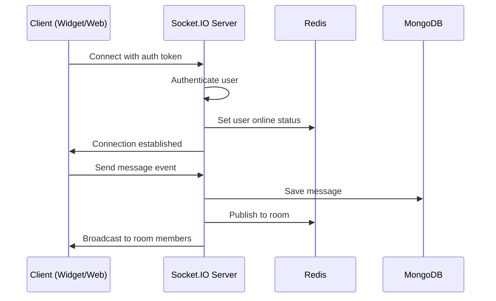

## Overview

Voxora's real-time chat system is built on **Socket.IO**, providing bidirectional, event-based communication between clients and servers. This enables instant message delivery, typing indicators, presence updates, and more.

## Architecture



## Connection Flow

### 1. Client Connection

Clients connect to the Socket.IO server with authentication:

<CodeGroup>

```javascript Widget/Browser
import io from 'socket.io-client';

const socket = io('http://localhost:3002', {
  auth: {
    token: 'jwt-token-here'
  },
  transports: ['websocket', 'polling']
});

socket.on('connect', () => {
  console.log('Connected:', socket.id);
});
```

```javascript Server
io.use(async (socket, next) => {
  const token = socket.handshake.auth.token;
  
  try {
    const decoded = jwt.verify(token, process.env.JWT_SECRET);
    socket.userId = decoded.userId;
    next();
  } catch (err) {
    next(new Error('Authentication error'));
  }
});
```

</CodeGroup>

### 2. Authentication

<Steps>
  <Step title="Token Validation">
    Server validates JWT token from handshake
  </Step>
  <Step title="User Loading">
    Load user data from database
  </Step>
  <Step title="Room Assignment">
    Join user to appropriate rooms (conversations, departments)
  </Step>
  <Step title="Presence Update">
    Update user online status in Redis
  </Step>
</Steps>

## Core Events

### Message Events

<Tabs>
  <Tab title="send_message">
    **Client → Server**: Send a new message
    
    ```javascript
    socket.emit('send_message', {
      conversationId: '123',
      content: 'Hello!',
      type: 'text' // or 'file', 'image'
    });
    ```
  </Tab>
  
  <Tab title="new_message">
    **Server → Client**: Receive a new message
    
    ```javascript
    socket.on('new_message', (message) => {
      console.log('New message:', message);
      // Update UI
    });
    ```
  </Tab>
  
  <Tab title="message_delivered">
    **Server → Client**: Message delivery confirmation
    
    ```javascript
    socket.on('message_delivered', (messageId) => {
      // Update message status to delivered
    });
    ```
  </Tab>
</Tabs>

### Typing Indicators

<CodeGroup>

```javascript Client
// User starts typing
socket.emit('typing_start', {
  conversationId: '123'
});

// User stops typing
socket.emit('typing_stop', {
  conversationId: '123'
});

// Listen for others typing
socket.on('user_typing', ({ userId, userName }) => {
  showTypingIndicator(userName);
});
```

```javascript Server
socket.on('typing_start', ({ conversationId }) => {
  socket.to(conversationId).emit('user_typing', {
    userId: socket.userId,
    userName: socket.user.name
  });
});
```

</CodeGroup>

### Presence Events

Track when users come online or go offline:

<CodeGroup>

```javascript Client
socket.on('user_online', ({ userId }) => {
  updateUserStatus(userId, 'online');
});

socket.on('user_offline', ({ userId }) => {
  updateUserStatus(userId, 'offline');
});
```

```javascript Server
io.on('connection', (socket) => {
  // User comes online
  socket.broadcast.emit('user_online', {
    userId: socket.userId
  });
  
  socket.on('disconnect', () => {
    // User goes offline
    io.emit('user_offline', {
      userId: socket.userId
    });
  });
});
```

</CodeGroup>

## Rooms & Namespaces

### Conversation Rooms

Each conversation has its own room for message broadcasting:

```javascript
// Join a conversation
socket.on('join_conversation', async ({ conversationId }) => {
  await socket.join(conversationId);
  
  // Send only to this room
  io.to(conversationId).emit('user_joined', {
    userId: socket.userId
  });
});

// Leave a conversation
socket.on('leave_conversation', ({ conversationId }) => {
  socket.leave(conversationId);
});
```

### Department Namespaces

Organize agents by department:

```javascript
const departmentNamespace = io.of('/department');

departmentNamespace.on('connection', (socket) => {
  const { departmentId } = socket.handshake.query;
  socket.join(`dept_${departmentId}`);
});
```

## Message Persistence

Messages are saved to MongoDB before being broadcast:

<CodeGroup>

```javascript Server Handler
socket.on('send_message', async (data) => {
  try {
    // 1. Create message in database
    const message = await Message.create({
      conversationId: data.conversationId,
      senderId: socket.userId,
      content: data.content,
      type: data.type,
      timestamp: new Date()
    });
    
    // 2. Broadcast to conversation room
    io.to(data.conversationId).emit('new_message', message);
    
    // 3. Send delivery confirmation
    socket.emit('message_delivered', message._id);
    
    // 4. Update conversation's last message
    await Conversation.findByIdAndUpdate(
      data.conversationId,
      { lastMessage: message._id, updatedAt: new Date() }
    );
    
  } catch (error) {
    socket.emit('message_error', {
      error: error.message
    });
  }
});
```

</CodeGroup>

## Scalability with Redis

For multi-server deployments, use the Redis adapter:

```javascript
import { createAdapter } from '@socket.io/redis-adapter';
import { createClient } from 'redis';

const pubClient = createClient({ url: 'redis://localhost:6379' });
const subClient = pubClient.duplicate();

await Promise.all([pubClient.connect(), subClient.connect()]);

io.adapter(createAdapter(pubClient, subClient));
```

<Info>
  This allows Socket.IO instances across multiple servers to communicate via Redis pub/sub.
</Info>

## Error Handling

Implement robust error handling for connection issues:

<CodeGroup>

```javascript Client
socket.on('connect_error', (error) => {
  console.error('Connection error:', error);
  // Show reconnection UI
});

socket.on('reconnect', (attemptNumber) => {
  console.log('Reconnected after', attemptNumber, 'attempts');
  // Rejoin rooms, sync state
});

socket.on('reconnect_failed', () => {
  console.error('Failed to reconnect');
  // Show offline mode
});
```

```javascript Server
io.engine.on('connection_error', (err) => {
  console.log(err.req);      // the request object
  console.log(err.code);     // the error code
  console.log(err.message);  // the error message
  console.log(err.context);  // additional error context
});
```

</CodeGroup>

## Performance Optimization

### 1. Message Batching

Batch multiple messages to reduce events:

```javascript
const messageBuffer = [];
const BATCH_SIZE = 10;
const BATCH_INTERVAL = 100; // ms

socket.on('send_message', (message) => {
  messageBuffer.push(message);
  
  if (messageBuffer.length >= BATCH_SIZE) {
    flushMessages();
  }
});

setInterval(() => {
  if (messageBuffer.length > 0) {
    flushMessages();
  }
}, BATCH_INTERVAL);
```

### 2. Binary Data

Use binary transmission for file uploads:

```javascript
// Client
socket.emit('file_upload', fileBuffer);

// Server
socket.on('file_upload', (buffer) => {
  // Handle binary data
});
```

### 3. Compression

Enable per-message deflate compression:

```javascript
const io = new Server(server, {
  perMessageDeflate: {
    threshold: 1024 // Only compress messages > 1KB
  }
});
```

## Security Best Practices

<CardGroup cols={2}>
  <Card title="Authentication" icon="key">
    Always verify JWT tokens on connection
  </Card>
  <Card title="Authorization" icon="shield">
    Check user permissions before joining rooms
  </Card>
  <Card title="Input Validation" icon="filter">
    Validate and sanitize all incoming data
  </Card>
  <Card title="Rate Limiting" icon="gauge">
    Limit events per user to prevent abuse
  </Card>
</CardGroup>

### Rate Limiting Example

```javascript
import rateLimit from 'express-rate-limit';

const limiter = rateLimit({
  windowMs: 60 * 1000, // 1 minute
  max: 50, // 50 messages per minute
  handler: (socket) => {
    socket.emit('rate_limit_exceeded');
  }
});

socket.on('send_message', limiter, handleSendMessage);
```

## Testing Socket.IO

Example test with Socket.IO client:

```javascript
import { io as Client } from 'socket.io-client';

describe('Chat Socket', () => {
  let clientSocket;
  
  beforeEach((done) => {
    clientSocket = Client('http://localhost:3002', {
      auth: { token: 'test-token' }
    });
    clientSocket.on('connect', done);
  });
  
  afterEach(() => {
    clientSocket.close();
  });
  
  it('should receive messages', (done) => {
    clientSocket.on('new_message', (message) => {
      expect(message.content).toBe('Hello');
      done();
    });
    
    clientSocket.emit('send_message', {
      conversationId: '123',
      content: 'Hello'
    });
  });
});
```

## Next Steps

<CardGroup cols={2}>
  <Card
    title="API Reference"
    icon="book"
    href="/api-reference/introduction"
  >
    Explore REST API endpoints
  </Card>
  <Card
    title="Widget Integration"
    icon="window"
    href="/widget/installation"
  >
    Add the chat widget to your site
  </Card>
  <Card
    title="Development Setup"
    icon="code"
    href="/development/setup"
  >
    Set up your environment
  </Card>
  <Card
    title="Architecture"
    icon="diagram-project"
    href="/core-concepts/architecture"
  >
    System architecture overview
  </Card>
</CardGroup>
